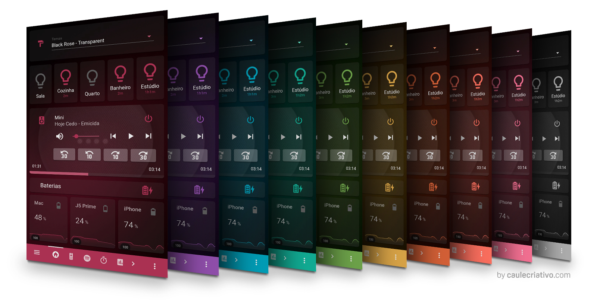
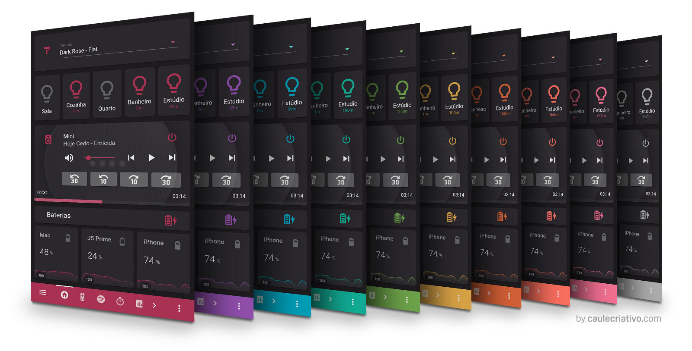
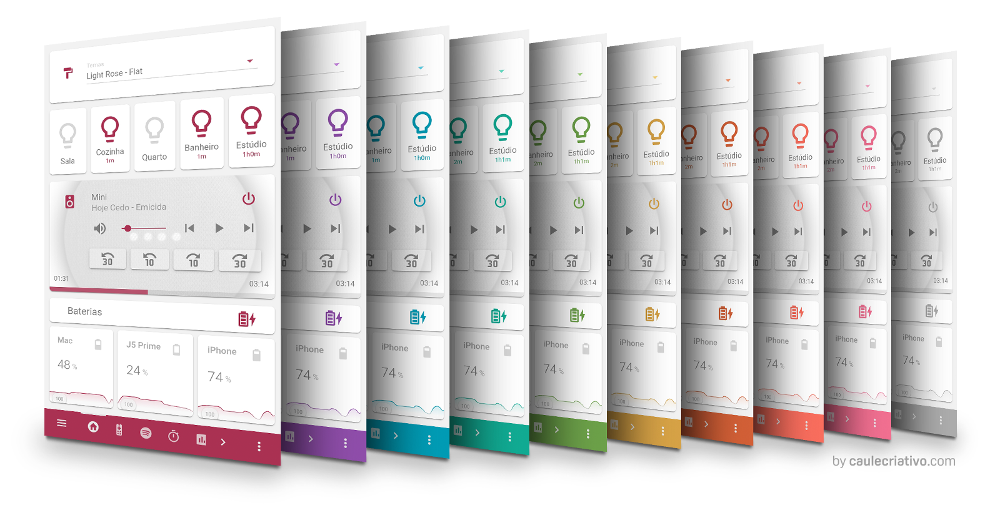
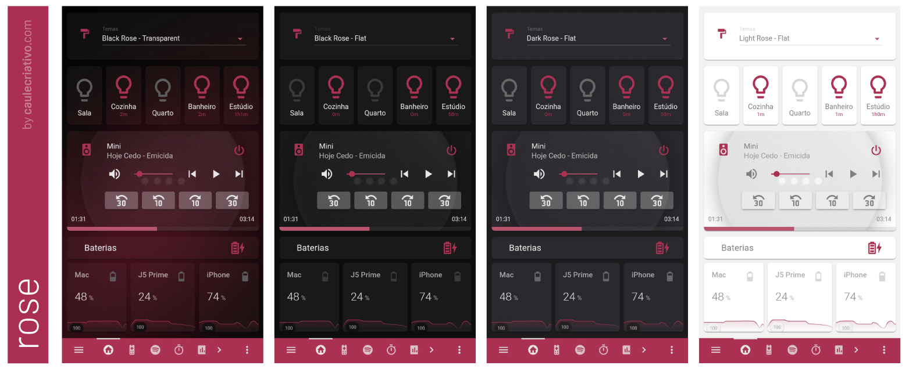
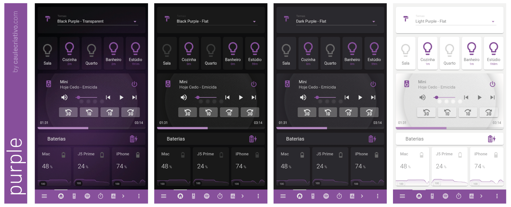
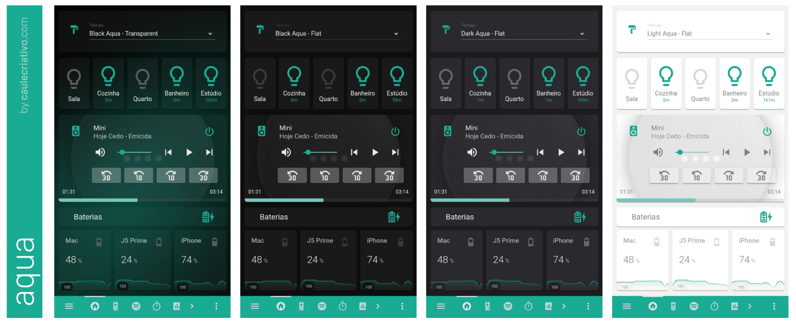
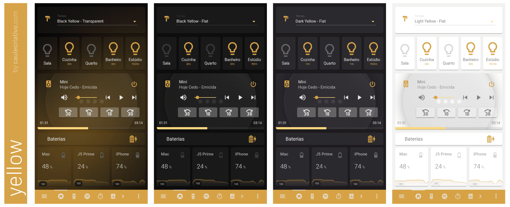
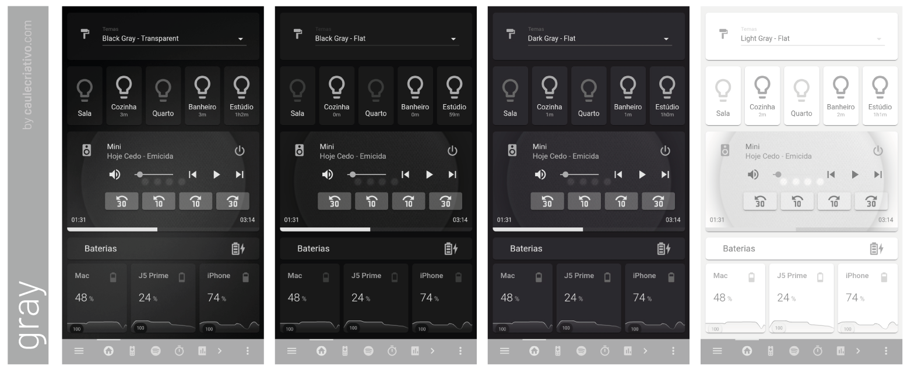
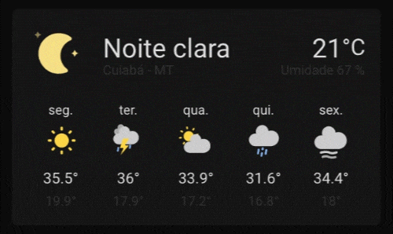

# Caule Themes Pack 1 - by caulecriativo.com
<!---[](https://github.com/custom-components/hacs)--->
[](https://forum.homeassistantbrasil.com.br/t/caule-themes-pack-1-by-caulecriativo-com/1422)
[](http://habr.ml)
[](https://community.home-assistant.io/t/caule-themes-pack-1-by-caulecriativo-com/209436)
[](https://github.com/orickcorreia/caule-themes-pack-1)
[](https://github.com/orickcorreia)


[English version](README.md)

Criado por Ricardo Correia para a comunidade Home Assistant Brasil.
* 10 cores modernas;
* 4 categorias de estilos;
  - Black Glass
  - Black
  - Dark
  - Light
* 40 temas no total;
* Ícones animados para o card de previsão do tempo;
* E de bônus um seletor de temas automático para sua interface.

**Em breve estará disponível para instalação no HACS (Home Assistant Community Store)**

Quero pedir apenas 2 coisas para quem se beneficiar com esses temas:

1) Entre na comunidade HABR no Discord: [habr.ml](http://habr.ml)
2) Siga meu estúdio de criação no instagram: [caulecriativo.com](http://caulecriativo.com)

Faça bom aproveito dos temas ☺️


















# Ícones animados inclusos


<div>


<br>


</div>


<br><br>
# Se você AINDA NÃO tem a pasta "themes"

Então você precisa configurar seu arquivo **configuration.yaml**, acrescentando o código que segue abaixo para que o seu Home Assistant busque os temas na pasta **themes**:

```
frontend:
  themes: !include_dir_merge_named themes
```

**ATENÇÃO! É necessário reiniciar após essa configuração!**:

# Instalação via HACS (Home Assistant Community Store)
(Se você não o HACS) [Saiba como instalar](https://hacs.xyz/docs/installation/manual) 

* Vá até a loja HACS
* Clique em **"Frontend"**
* Clique no botão **(+)**
* Procure por **"Caule Themes Pack"**
* E por fim clique em **"Install"**


# Instalação manual dos temas

Faça o download do **caule-themes-pack-1.yaml** [**clicando aqui**](https://raw.githubusercontent.com/orickcorreia/caule-themes-pack-1/master/src/caule-themes-pack-1.yaml) e copie o arquivo para sua pasta **themes**


Após inserir a configuração no seu **configuration.yaml**, faça o download do arquivo **caule-themes-pack-1.yaml** [**clicando aqui**](https://raw.githubusercontent.com/orickcorreia/caule-themes-pack-1/master/src/caule-themes-pack-1.yaml)

Copie o arquivo **caule-themes-pack-1.yaml** para sua pasta **themes**. Se sua pasta **themes** ainda não existir, você deve cria-la dentro da pasta **config**


## Download dos backgrounds e dos ícones
10 dos 40 temas possuem backgrounds e todos os temas usam ícones animados para o card de previsão do tempo. Esses arquivos precisam ser baixados e copiados para o seu servidor do Home Assistant.

1. Baixe os backgrounds e ícones [**clicando aqui.**](https://github.com/orickcorreia/caule-themes-pack-1/raw/master/src/backgrounds-icons.zip) 
2. Extraia o arquivo **.zip**
3. Copie a pasta **caule-themes-pack** para dentro da pasta **config/www/**. O caminho final para a pasta dos arquivos deve ser **config/www/caule-themes-pack-1/**

*ATENÇÃO! Se sua pasta **www** ainda não existir, crie ela dentro da pasta **config**.*

Agora **reinicie o seu Home Assistante** e os temas estarão disponíveis para uso.
<br><br>


# Criando um seletor de temas automático para a interface (opcional)
Vamos criar um seletor de temas para ser implementado na sua interface do usuário. É uma forma prática de alterar o tema instantaneamente em todos os dispositivos conectados ao seu Home Assistant. Veja como funciona no gif abaixo:


## 1ª Etapa - Criando o input_select
O input_select será usado para criar a lista de seleção com os temas que eu criei.<br>
Insira esse código no seu arquivo **configuration.yaml**<br>
Se você nunca usou input select, [saiba mais clicando aqui.](https://www.home-assistant.io/integrations/input_select)<br><br>
```
input_select:

  themes:
    name: 'Temas'
    icon: mdi:format-paint
    options:
      - Caule Black Rose
      - Caule Black Purple
      - Caule Black Blue 
      - Caule Black Aqua
      - Caule Black Green
      - Caule Black Yellow
      - Caule Black Orange
      - Caule Black Coral
      - Caule Black Pink
      - Caule Black Gray
      - Caule Dark Rose
      - Caule Dark Purple
      - Caule Dark Blue 
      - Caule Dark Aqua
      - Caule Dark Green
      - Caule Dark Yellow
      - Caule Dark Orange
      - Caule Dark Coral
      - Caule Dark Pink
      - Caule Dark Gray
      - Caule Light Rose
      - Caule Light Purple
      - Caule Light Blue 
      - Caule Light Aqua
      - Caule Light Green
      - Caule Light Yellow
      - Caule Light Orange
      - Caule Light Coral
      - Caule Light Pink
      - Caule Light Gray
      - Caule Black Rose Glass
      - Caule Black Purple Glass
      - Caule Black Blue Glass 
      - Caule Black Aqua Glass
      - Caule Black Green Glass
      - Caule Black Yellow Glass
      - Caule Black Orange Glass
      - Caule Black Coral Glass
      - Caule Black Pink Glass
      - Caule Black Gray Glass      
      - Default
```
Reinicie o seu Home Assistant para que o input_select seja criado.


Resultado:
* input_select.themes


## 2ª Etapa - Automação do seletor de temas no Node-RED

**ATENÇÃO!** Se você nunca usou o Node-RED, [saiba mais clicando aqui.](https://github.com/hassio-addons/addon-node-red)


Vamos criar um flow no Node-RED para definir o tema automaticamente toda vez que você escolher um tema na sua interface. É bem simples! Basta fazer o download do arquivo .json ou copiar o código e colar na janela de importação do Node-RED.


[Clique aqui para copiar ou fazer download do código dos fluxos do Node-RED](https://raw.githubusercontent.com/orickcorreia/caule-themes-pack-1/master/src/seletor_theme_nodered.json)


Após importar o flow para o seu Node-RED, clique em **Deply**<br><br>

## 3ª Etapa - Implementando o seletor na sua interface

Agora é só inserir o código do seletor na sua interface.
* Se você usa a interface no Modo YAML, copie o código e insira no seu **ui-lovelace.yaml**
* Se você usa a interface no modo automático, vá até o modo de edição da sua interface, escolha a opção "manual" lá no final, depois copie e cole o código abaixo.

``` 
  type: entities
  show_header_toggle: false
  entities:
    - entity: input_select.themes

``` 

## 4ª Etapa - Configurando o tema "Backend-selected"

Altere o tema no perfil do usuário para "Backend-selected". Dessa forma todos os dispositivos conectados que estiverem com o tema "Backend-selected" terão seus temas alterados sincronizadamente com o seletor de temas que você acabou de criar.


### Agora é só aproveitar!
### Se tudo der certo, [mande um print](http://api.whatsapp.com/send?phone=5565999593909) ☺️


Ícones criados pela [amCharts](https://www.amcharts.com/free-animated-svg-weather-icons/) e modificados por mim.
